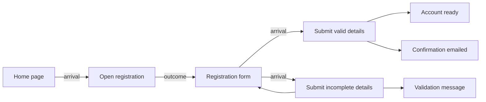

# Behavior Graph Specification

A specification for connected, traceable software requirements.

Version: 0.2 — Public draft

Date: 2026-10-05

## Contents

- [1. Purpose and scope](#1-purpose-and-scope)
- [2. Vocabulary](#2-vocabulary)
- [3. Graph model](#3-graph-model)
- [4. Action and flow semantics](#4-action-and-flow-semantics)
- [5. Authoring and validation](#5-authoring-and-validation)
- [6. Reading and changing the graph](#6-reading-and-changing-the-graph)
- [7. Rendering](#7-rendering)
- [8. Complete example](#8-complete-example)
- [9. Optional extension: intents and coverage](#9-optional-extension-intents-and-coverage)
- [10. Optional extension: versions and change impact](#10-optional-extension-versions-and-change-impact)
- [11. Optional extension: stories and rehearsal](#11-optional-extension-stories-and-rehearsal)
- [12. Optional extension: implementation and evidence](#12-optional-extension-implementation-and-evidence)
- [13. Entity references](#13-entity-references)
- [14. Storage and interchange](#14-storage-and-interchange)
- [15. Adoption and acceptance checks](#15-adoption-and-acceptance-checks)
- [Reference library and CLI](#reference-library-and-cli)
- [Changes from 0.1](#changes-from-01)
- [License](#license)

## 1. Purpose and scope

Describe a product as a graph that people can read, tools can validate, and implementers can trace into code. Store each observable state once. Describe each action as a small Given–When–Then scenario referencing those states. Derive the flow between scenarios from the states they share.

The same graph supports requirements conversations, change review, journey exploration, implementation planning, and feedback about a particular version of a requirement. It remains useful without agents or automated implementation.

This document defines an open, implementation-independent model and its authoring rules. **MUST** identifies a requirement of the model; **SHOULD** identifies a recommended practice; **MAY** identifies an optional capability. Sections labeled optional extensions apply only to implementations that support those extensions.

The core comprises states, scenarios, personas, journeys, validation, rendering, and derived flow. Storage technology, programming language, user interface, model providers, and orchestration are implementation choices. Intents, versioning, story generation, code traceability, and evidence are optional extensions described below.

The examples in this document are output of the reference library and CLI in this repository (see [Reference library and CLI](#reference-library-and-cli)); its tests pin every value shown. The node files of the complete example are in [`examples/registration/nodes/`](examples/registration/nodes/), and the draft from §6.4 is in [`examples/registration/draft.json`](examples/registration/draft.json). Rendered text, agenda items, fingerprints, and dry-run results shown below are its output for those files. Fingerprint strings depend on the serialization and hash choices in §14; other implementations can produce different strings.

### Relationship to Gherkin

The model borrows Gherkin's context, action/event, and observable-outcome structure. Standard Gherkin organizes these steps in scenarios and connects them to executable step definitions. See the [Cucumber Gherkin reference](https://cucumber.io/docs/gherkin/reference/).

The graph is the authoritative representation here. The text view adds scenario IDs, `By`, `In`, and `Status` lines; it is a Gherkin-inspired rendering, not a directly executable `.feature` file. A Cucumber exporter would need to generate standard scenarios, map metadata to tags or comments, and supply step definitions. Such an exporter is outside this specification.

## 2. Vocabulary

| Term | Meaning |
| --- | --- |
| **State** | One observable fact or condition, identified independently of its wording. |
| **Scenario** | One specified action or event in a particular case, with its prerequisites and expected outcome. Called a *card* in version 0.1. |
| **Arrival** | The scenario's primary prerequisite: where the actor starts. Rendered as its first `Given`. |
| **Context** | Additional prerequisites needed by the scenario. Rendered as `And` after `Given`. |
| **Outcome state** | A fact expected after the scenario's action. Rendered as `Then` and subsequent `And` lines. |
| **Persona** | An actor role, including how that actor reaches and perceives the product. |
| **Journey** | A named set of scenarios belonging to a recognizable activity. Membership does not specify their order. |
| **Intent** | What a product, or one area of it, is for: a title, the problem, and its statements (§9). |
| **Statement** | One outcome, constraint, or question that belongs to an intent (§9). |
| **Story** | An ordered sequence of scenarios selected for examination or testing. Derived from the graph. |
| **Draft** | An ordered list of authoring operations evaluated over a snapshot without changing the accepted graph. |
| **Finding** | A validation result with a severity, a stable code, a message, and the IDs it concerns. |
| **Agenda** | Questions raised by incomplete or suspicious parts of the graph. |
| **Node revision** | A fingerprint of one stored node, used to detect stale edits. |
| **Scenario version** | A fingerprint of a scenario and the referenced wording it depends on, used to detect stale feedback and evidence. |
| **Entity reference** | A typed, optionally versioned pointer to a node, such as `gherkin/scenario:S-0002@e30089cbc147` (§13). |

A scenario is a requirement, not a task ticket. A journey is a grouping, not a second copy of the requirements. A story is a selected walk, not a new source of truth.

## 3. Graph model

### 3.1 Node envelope

The portable representation is a directed property graph. Every node MUST have:

```ts
type Node = {
  id: string
  type: string
  props: Record<string, JsonValue>
  edges: Array<{
    type: string
    to: string
    props?: Record<string, JsonValue>
  }>
}
```

`JsonValue` means a JSON primitive, array, or object. IDs MUST be unique within a graph and match `^[A-Za-z0-9._-]+$`. Editing wording MUST preserve the node's ID. Types are namespaced as `<namespace>/<kind>`; this specification uses `gherkin/<kind>`.

Edges are owned by their source node. A target MUST exist and have the type required by the edge. The same source MUST NOT contain two edges with the same `(type, to)` pair. One state MAY appear in several different roles on the same scenario, including both arrival and outcome.

The core defines no outgoing edges for states, personas, or journeys. An extension MAY add namespaced relationships with declared source and target types; §9 is one such extension. Extensions MUST preserve the meaning of the core relationships.

A minimal node:

```json
{
  "edges": [],
  "id": "ST-0002",
  "props": { "text": "the registration form is shown" },
  "type": "gherkin/state"
}
```

### 3.2 Node kinds

| Type | Properties | Meaning |
| --- | --- | --- |
| `gherkin/state` | `text: string`; optional `entry: boolean`, `terminal: boolean` | A reusable prerequisite or outcome sentence. |
| `gherkin/scenario` | `title: string`, `when: string`; optional `planned: boolean` | One action/event and its case. |
| `gherkin/persona` | `name: string`, `kind: "human" \| "cli" \| "agent"`, `text: string` | An actor's name, interaction category, and role description. |
| `gherkin/journey` | `name: string` | A named collection of scenarios. |

Required strings MUST be nonempty. Authors SHOULD remove surrounding whitespace and use meaningful sentences. State text, persona names, and journey names are unique within their respective kinds after the normalization in §5.2. Scenario titles need not be unique; IDs distinguish them.

`planned` SHOULD be stored only while true. Clearing it removes the property instead of storing `false`.

The persona kind `human` identifies a person using the product, `cli` an automated actor interacting through its command line, and `agent` an agent within the product. These categories describe interaction roles; they do not grant permissions.

Examples use `ST-0001` for states, `S-0001` for scenarios, `P-0001` for personas, and `J-0001` for journeys; §9 adds `I`, `O`, `K`, and `Q`. These prefixes are illustrative; consumers MUST read `type` rather than infer it from an ID. Implementations MAY choose any allocation scheme that satisfies the ID rules. One simple scheme takes the highest existing number for a prefix, including reserved IDs (§14), and adds one: `ST-0006` follows `ST-0005`.

### 3.3 Scenario relationships

| Edge | Source → target | Count per scenario | Meaning |
| --- | --- | --- | --- |
| `gherkin/arrives` | scenario → state | Exactly 1 | Primary `Given`. |
| `gherkin/given` | scenario → state | 0–3 | Additional context prerequisites. |
| `gherkin/then` | scenario → state | 1–5 | Facts making up this case's outcome. |
| `gherkin/by` | scenario → persona | 1 or more for newly authored scenarios | Who acts. |
| `gherkin/in` | scenario → journey | 0 or more | Which activities include this scenario. |

The same limits, written as a declarative edge table that a generic validator can read:

```json
{
  "arrives": { "from": "scenario", "to": "state", "min": 1, "max": 1 },
  "given":   { "from": "scenario", "to": "state", "max": 3 },
  "then":    { "from": "scenario", "to": "state", "min": 1, "max": 5 },
  "by":      { "from": "scenario", "to": "persona" },
  "in":      { "from": "scenario", "to": "journey" }
}
```

Keys are local edge names in the `gherkin` namespace; `from` and `to` are local node kinds. `to` MAY be an array when an edge accepts several target kinds. A missing `min` means zero and a missing `max` means no limit. The `by` minimum is enforced by authoring operations (§6.2), not by the table, so imported scenarios without personas remain loadable.

An importer MAY retain incomplete scenarios without personas, but MUST expose the missing attribution as an agenda item. Authoring MUST require a persona when creating a scenario and MUST refuse to unlink its last persona.

Multiple personas identify the roles associated with the same action. They do not encode an ordered handoff or a synchronization protocol. Use separate scenarios for separate actions by different actors.

### 3.4 States are facts, not complete world snapshots

`the payment form is shown` and `a receipt is emailed` are both states. Several states may hold after one action. The graph does not declare all states mutually exclusive, nor does it model the entire application state.

An `entry` state can be supplied as a starting condition without an earlier scenario establishing it. A `terminal` state is an acceptable endpoint that does not require a following action. These flags suppress completeness questions; they do not prohibit incoming or outgoing flow. A terminal side effect can accompany another outcome state from which the interaction continues.

## 4. Action and flow semantics

For a scenario `C`, let `arrival(C)` be its single arrival state, `context(C)` its extra prerequisites, and `outcomes(C)` its outcome states.

Its requirement reads:

> Given the arrival and every context condition, when the specified action occurs in this case, every outcome condition is expected to hold.

The outcome list is conjunctive. Two `then` edges mean two expected facts, not two alternative results.

Scenario-to-scenario adjacency MUST be derived as:

```text
A → B  exactly when  arrival(B) is in outcomes(A)
```

Do not store a separate authoritative `next-scenario` relationship. Changing a shared state reference must be sufficient to change the flow.

This relation establishes a possible continuation. Extra context conditions are not evaluated by the graph walk. A tester or execution adapter must establish them before treating a path as executable. The graph also has no built-in predicates, variable binding, timing model, or state invalidation rules.

### 4.1 Choices, cases, and loops

- **Choice:** several scenarios share an arrival state and describe different actions.
- **Success and failure:** separate scenarios describe distinguishable cases, with case-specific actions/events and their respective outcomes.
- **Several consequences:** one scenario has several outcome states that all belong to the same case.
- **Retry:** a scenario may lead back to its own arrival state, usually alongside an error-message state.
- **Shared continuation:** several scenarios may lead to the same state, which later scenarios reuse as their arrival.

Authors MUST NOT combine success and failure in one outcome list. Describe the case concretely, for example `the visitor submits incomplete registration details`; avoid `if` clauses. The graph cannot prove that cases are mutually exclusive or exhaustive. Review must assess that separately.

### 4.2 Stored graph versus flow view

Physically, all five core edge types point outward from scenarios. A flow diagram reverses the arrival relation for readability:



This is a view of the requirements. It does not add reverse edges to storage.

## 5. Authoring and validation

### 5.1 Atomic language

State sentences and `when` clauses MUST:

- Have at most 15 whitespace-delimited words.
- Avoid the standalone word `if`, case-insensitively.
- Express one fact or one action/event.

A standalone `and` inside a clause SHOULD produce a warning, not a rejection: it may join two facts, but it can also belong to an ordinary name. A standalone `or` inside a `when` clause SHOULD also produce a warning: when the alternatives lead to different outcomes, they are separate scenarios. Separate facts into separate referenced states. The rendered `And` keyword between clauses is allowed.

Persona names MUST have at most four words; role descriptions MUST have at most 60 words. A role description SHOULD explain who the actor is, how they interact, and what they can see. Titles SHOULD start with a recognizable actor name and describe the action. Mechanical checks can enforce word counts and prohibited words; semantic atomicity requires review of the meaning.

Write externally meaningful behavior. Internal packages, classes, and algorithms belong in implementation plans unless they are themselves part of the actor's observable contract.

### 5.2 State reuse

Normalize text for exact matching by performing these operations in order:

1. Lowercase.
2. Trim surrounding whitespace.
3. Collapse consecutive whitespace to one space.
4. Remove one trailing period, if present.

State references in authoring operations accept either `{ "id": "ST-0001" }` or `{ "text": "the registration form is shown" }`. An ID reference MUST resolve to an existing state. A text reference MUST reuse an exact normalized match or create a state when none exists. Newly created states MUST also be available for reuse within that same operation.

For example, `{ "text": "The registration form is shown." }` resolves to `ST-0002` in the complete example, because both normalize to `the registration form is shown`.

An explicit request to add a separate state with duplicate normalized text MUST be rejected with the existing ID. Rewording a state MUST preserve uniqueness. Persona and journey references resolve existing nodes by ID or normalized name; referencing an unknown name does not create one implicitly.

Near matches SHOULD be shown for review. One possible heuristic is the Jaccard similarity of normalized word sets: the number of shared words divided by the number of distinct words across both sentences. A score of `0.8` or greater can trigger a warning. The choice of heuristic is implementation-specific; wording similarity MUST NOT cause an automatic merge.

Reuse a state only when its meaning is the same. When superficially similar conditions describe different actors or situations, make that distinction explicit in their text.

### 5.3 Three kinds of validation result

| Result | Examples | Effect |
| --- | --- | --- |
| **Error** | Missing target; wrong edge type; duplicate edge; invalid cardinality; duplicate normalized state; clause too long | Reject the proposed write. |
| **Warning** | Near-duplicate wording; `and` within a clause; `or` within a `when` | Accept an otherwise valid write and return the warning. |
| **Agenda item** | No continuation; no way to reach a state; missing persona attribution | Keep the incomplete graph usable and ask a focused question. |

A structurally valid graph may still describe an incomplete product. Implementations MUST keep those two conditions distinct.

Errors and warnings SHOULD be reported as findings:

```ts
type Finding = {
  severity: "error" | "warn"
  code: string          // stable, machine-readable
  message: string       // names the node and the repair
  about: Array<string>  // node IDs, most specific first
}
```

For example:

```json
{
  "severity": "error",
  "code": "conditional",
  "message": "S-0004: \"the visitor submits the form again if it failed\" contains \"if\"; make one scenario per case instead",
  "about": ["S-0004"]
}
```

Implementations SHOULD use these codes, or document their own mapping to them:

| Code | Severity | Condition |
| --- | --- | --- |
| `unknown-type` | error | A node type no namespace declares. |
| `unknown-edge` | error | An edge type no namespace declares. |
| `edge-source` | error | An edge starts at the wrong node kind. |
| `edge-target` | error | An edge ends at the wrong node kind. |
| `too-few-edges` | error | Fewer edges of a type than its minimum. |
| `too-many-edges` | error | More edges of a type than its maximum. |
| `duplicate-edge` | error | The same `(type, to)` pair twice on one source. |
| `missing-target` | error | An edge points at a node that does not exist. |
| `invalid-props` | error | Properties do not match the node kind's schema. |
| `clause-too-long` | error | A clause exceeds its word limit. |
| `conditional` | error | A clause contains a standalone `if`. |
| `duplicate-state` | error | Two states share normalized text. |
| `duplicate-persona` | error | Two personas share a normalized name. |
| `duplicate-journey` | error | Two journeys share a normalized name. |
| `persona-name-long` | error | A persona name exceeds four words. |
| `persona-text-long` | error | A role description exceeds 60 words. |
| `and-chaining` | warn | A clause contains a standalone `and`. |
| `alternatives` | warn | A `when` clause contains a standalone `or`. |
| `near-duplicate-state` | warn | Two states have similar wording. |

Missing targets, stale revisions, and damaged files are failures of the write boundary rather than findings about content (§6.3, §14). They SHOULD still carry the affected IDs and a repair instruction.

### 5.4 Completeness agenda

An agenda SHOULD identify:

- An empty requirements graph: establish a starting condition and first action.
- A state that no scenario uses in any role: use it or remove it. Report this as one question, not as both of the next two.
- A nonterminal state that no scenario uses as an arrival or context: explain what can happen while it holds, or mark the endpoint intentional.
- A nonentry state with no scenario producing it: explain how it is reached or mark it as a supplied starting condition.
- Similar states that may need to be merged.
- No personas, scenarios with no actors, and unused personas.

These checks examine local relationships. A closed cycle can satisfy them while remaining unreachable from an entry. Context-only states can also need an explicit explanation of how they are supplied.

When those questions are resolved, a tool MAY suggest reviewing states with only one outgoing action for missing cases. One outgoing action is not evidence that a failure case is required. Multiple scenarios sharing an arrival establish alternatives, but do not prove that a failure case is covered. A useful order puts the most-reached states first: those that more scenarios lead to.

Agenda items SHOULD have a stable ID, so that a tool can tell a new question from one already asked:

```ts
type AgendaItem = {
  id: string            // stable: "<namespace>:<check>[:<node id>...]"
  title: string         // the question
  detail: string        // why it is asked, and how to resolve it
  about: Array<string>  // node IDs
  priority: number      // 1 is most urgent
}
```

The complete example in §8 has one open agenda item, from its intent extension:

```json
{
  "id": "gherkin:question:Q-0001",
  "title": "Does an unconfirmed account expire?",
  "detail": "Q-0001 is open. Answer it with answer-question (as an outcome or a constraint when it decides one).",
  "about": ["Q-0001"],
  "priority": 2
}
```

After that question is answered, the suggestion step reports the one-way state:

```json
{
  "id": "gherkin:one-way:ST-0001",
  "title": "A failure case for \"Visitor opens registration\"",
  "detail": "S-0001 is the only way on from ST-0001. Given the home page is shown. When the visitor opens registration. Then the registration form is shown. Can it fail or go another way the user must handle?",
  "about": ["ST-0001", "S-0001"],
  "priority": 1
}
```

## 6. Reading and changing the graph

### 6.1 Read capabilities

An implementation SHOULD expose these operations independently of its UI:

| Capability | Result |
| --- | --- |
| Get node | Envelope and current node revision. |
| List by type | States, scenarios, personas, journeys, or extension kinds. |
| Query relationships | Outgoing edges and derived inbound edges. |
| Render scenarios | Current state wording, actions, personas, and journey membership. |
| List journey members | Scenario IDs; membership alone imposes no order. |
| Diff snapshots | Added, removed, and changed nodes keyed by ID. |
| Determine affected scenarios | Scenarios requiring reconsideration after a change, plus removed scenarios. |
| Read agenda | Specific questions tied to node IDs. |

A bounded neighborhood query is useful for focused work. Following a scenario to its persona and then backward to every scenario by that persona can select the whole product. Implementations SHOULD distinguish flow relationships from grouping and attribution relationships when defining neighborhood traversal. For example, a traversal can follow `by` and `in` backward only when their target is the original query focus.

A snapshot diff SHOULD report, for each changed node, both versions and the edges added, removed, and changed, matching edges by `(type, to)`.

### 6.2 Mutation contract

All accepted edits MUST pass through a validating write boundary. The minimum operations are adding and editing each node kind, linking and unlinking scenario relationships, and removing nodes.

A mutation produces proposed `Put(node)` and `Remove(id)` changes against a snapshot. Before persistence, validate the node envelopes, property schemas, edge types, endpoint types, cardinalities, uniqueness, and content rules. Validation failure MUST leave the accepted graph unchanged.

Linking an arrival replaces the previous arrival in one operation. Other links append a relationship after duplicate checks; linking an existing pair is a no-op. Removal MUST refuse a referenced node and identify its dependents; the author must first relink or remove those dependents. Removing a scenario does not automatically delete its states, personas, or journeys.

Errors SHOULD carry a stable code, the affected IDs, and a concrete repair instruction. A write response SHOULD identify added, changed, and removed IDs and any warnings.

The operation vocabulary below is RECOMMENDED for interchange of drafts (§6.4). Each operation is a JSON object `{ "tool": <name>, "params": <object> }`. State references use `{ "id" }` or `{ "text" }` (§5.2); persona and journey references use `{ "id" }` or `{ "name" }`.

| Operation | Parameters | Effect |
| --- | --- | --- |
| `add-state` | `text`, optional `entry`, `terminal` | Create a state. Duplicate normalized text is rejected with the existing ID. |
| `edit-state` | `id`, optional `text`, `entry`, `terminal` | Reword or reflag a state. Every scenario using it renders the new text. |
| `add-persona` | `name`, `kind`, `text` | Create a persona. |
| `edit-persona` | `id`, optional `name`, `kind`, `text` | Change a persona. |
| `add-journey` | `name` | Create a journey. |
| `edit-journey` | `id`, `name` | Rename a journey. |
| `add-scenario` | `title`, `when`, `by[]`, `arrives`, optional `given[]`, `then[]` | Create a scenario and any states its text references create. `by` MUST be nonempty. |
| `edit-scenario` | `id`, optional `title`, `when`, `planned` | Change a scenario. `planned: false` removes the flag. |
| `link` | `edge`, `scenario`, and one of `state`, `persona`, `journey` | Add a relationship. `arrives` replaces the current arrival. |
| `unlink` | `edge`, `scenario`, and the target ID | Remove a relationship. Refuses the last `by`. |
| `remove` | `id` | Remove a node that nothing references. |

A scenario created with `add-scenario` SHOULD store its edges in the order `by`, `arrives`, `given`, `then`. Later links append. Rendering groups edges by role (§7), so this order only affects serialization and fingerprints.

An `add-scenario` request and its result:

```json
{
  "tool": "add-scenario",
  "params": {
    "title": "Visitor reuses a registered email",
    "when": "the visitor submits an email that already has an account",
    "by": [{ "name": "Visitor" }],
    "arrives": { "id": "ST-0002" },
    "then": [{ "id": "ST-0002" }, { "text": "a message offers to reset the password" }]
  }
}
```

```json
{
  "changes": [
    { "_tag": "Put", "node": { "id": "ST-0006", "type": "gherkin/state", "props": { "text": "a message offers to reset the password" }, "edges": [] } },
    { "_tag": "Put", "node": { "id": "S-0004", "type": "gherkin/scenario",
        "props": { "title": "Visitor reuses a registered email", "when": "the visitor submits an email that already has an account" },
        "edges": [
          { "type": "gherkin/by", "to": "P-0001" },
          { "type": "gherkin/arrives", "to": "ST-0002" },
          { "type": "gherkin/then", "to": "ST-0002" },
          { "type": "gherkin/then", "to": "ST-0006" }
        ] } }
  ],
  "message": "created S-0004; new states ST-0006"
}
```

### 6.3 Stale edits

Writers SHOULD support expected node revisions, including an `absent` expectation for creation. Before applying a proposed edit, compare its expectations with current nodes and reject mismatches. Callers should include every previously read node whose content matters to the edit, not just the node they intend to write.

An expectation maps IDs to revisions:

```json
{ "ST-0002": "034e490894fd", "ST-0006": "absent" }
```

On a stale result, reread and reconcile the proposed change with the current requirement. Do not silently overwrite it. Revision checks need a serialized writer or transactional storage to provide strong concurrent-write guarantees; hash comparison alone is insufficient.

### 6.4 Drafts and previews

A draft is an ordered list of ordinary authoring operations. Each operation sees the working snapshot left by earlier successful operations. A draft MUST NOT modify the accepted graph.

This draft ([`examples/registration/draft.json`](examples/registration/draft.json)) rewords the form state, adds a scenario, and puts the new scenario in the journey. The third operation refers to `S-0004`, which the second operation creates:

```json
[
  { "tool": "edit-state", "params": { "id": "ST-0002", "text": "the sign-up form is shown" } },
  { "tool": "add-scenario", "params": {
      "title": "Visitor reuses a registered email",
      "when": "the visitor submits an email that already has an account",
      "by": [{ "name": "Visitor" }],
      "arrives": { "id": "ST-0002" },
      "then": [{ "id": "ST-0002" }, { "text": "a message offers to reset the password" }] } },
  { "tool": "link", "params": { "edge": "in", "scenario": "S-0004", "journey": "Create an account" } }
]
```

Expose a dry run that reports validity, problems, touched nodes, and affected scenarios. For the draft above:

```json
{
  "ok": true,
  "problems": [],
  "touched": ["S-0004", "ST-0002", "ST-0006"],
  "scenarios": ["S-0001", "S-0002", "S-0003", "S-0004"],
  "messages": ["updated ST-0002", "created S-0004; new states ST-0006", "linked S-0004 in J-0001"],
  "next": { "scenario": "S-0005", "state": "ST-0007", "journey": "J-0002", "persona": "P-0002" }
}
```

The draft touches only three nodes, but four scenarios are affected: `S-0001` through `S-0003` render the reworded `ST-0002`. `next` lists the IDs the following additions would receive; it is informational and reserves nothing.

Expose a comparison showing scenarios before and after, including scenarios indirectly affected by a shared-state edit. New or removed scenarios have an absent side of the comparison.

Every independently committed operation must preserve structural validity. Replacing a sole outcome therefore requires linking the replacement before unlinking the old outcome. An invalid intermediate operation cannot rely on a later operation to repair it.

A dry run SHOULD use the same validation rules as an accepted write and MUST identify any checks it could not perform. It MUST NOT report a draft as valid when an operation fails. An implementation MAY continue after a failed operation to collect more diagnostics, but MUST distinguish that partial preview from a valid proposal. This draft has three faulty operations:

```json
[
  { "tool": "add-scenario", "params": { "title": "Visitor retries", "when": "the visitor submits the form again if it failed",
      "by": [{ "name": "Visitor" }], "arrives": { "text": "The registration form is shown." }, "then": [] } },
  { "tool": "add-scenario", "params": { "title": "Visitor retries", "when": "the visitor submits the form again if it failed",
      "by": [{ "name": "Visitor" }], "arrives": { "text": "The registration form is shown." },
      "then": [{ "text": "the account is ready and a welcome page is shown" }] } },
  { "tool": "add-state", "params": { "text": "the account is ready" } }
]
```

Its dry run continues past the failures and reports all three problems, but is not `ok`:

```json
{
  "ok": false,
  "problems": [
    "add-scenario: S-0004 has 0 then edges; it needs 1-5",
    "add-state: ST-0003 already has this text; use it",
    "S-0004: \"the visitor submits the form again if it failed\" contains \"if\"; make one scenario per case instead"
  ],
  "touched": ["S-0004", "ST-0006"],
  "scenarios": ["S-0004"],
  "messages": ["created S-0004; new states ST-0006"],
  "next": { "scenario": "S-0005", "state": "ST-0007", "journey": "J-0002", "persona": "P-0002" }
}
```

The arrival text reused `ST-0002` by normalization. The `and` in the new outcome state is only a warning, so it does not appear among the problems.

Accepted writes MUST still undergo full validation against the current graph. A successful preview does not reserve node IDs or prevent concurrent edits; implementations SHOULD recheck the snapshot's revisions before applying a draft.

## 7. Rendering

A scenario MUST render its current referenced state text, rather than a copy saved inside the scenario. Render in this order:

1. Scenario ID and title.
2. Planned status, when present.
3. Personas and journeys, when present.
4. Arrival as `Given`, then context states as `And`.
5. Exactly one `When`.
6. First outcome as `Then`, then remaining outcomes as `And`.

Preserve edge order within each role so the presentation is stable. IDs SHOULD accompany displayed state text to make reuse and editing unambiguous. Missing references in a damaged or imported graph SHOULD be visibly marked, for example `<missing ST-0009>`, rather than invented or silently omitted. A full rendering SHOULD list states that no scenario uses after the scenarios.

A journey view derives order from flow, marks branches and loopbacks, and includes disconnected members. It MUST NOT manufacture a linear sequence just because scenarios belong to the same journey.

## 8. Complete example

This example describes registration, including a failure that leaves the form available for retry. The failure case is not built yet, so it is `planned`. It also carries the intent extension from §9. Each node is one file in [`examples/registration/nodes/`](examples/registration/nodes/), named `<id>.json` and serialized in the canonical form from §14:

```text
examples/registration/nodes/
  I-0001.json   J-0001.json   K-0001.json   O-0001.json   P-0001.json   Q-0001.json
  S-0001.json   S-0002.json   S-0003.json
  ST-0001.json  ST-0002.json  ST-0003.json  ST-0004.json  ST-0005.json
```

For reading, the core nodes are listed together here. The wrapper `{ "nodes": [...] }` is an illustration, not a storage layout.

```json
{
  "nodes": [
    {
      "id": "P-0001", "type": "gherkin/persona",
      "props": { "name": "Visitor", "kind": "human", "text": "A person creating an account through the website. They see forms, messages, and confirmation emails." },
      "edges": []
    },
    {
      "id": "J-0001", "type": "gherkin/journey",
      "props": { "name": "Create an account" },
      "edges": [{ "type": "gherkin/serves", "to": "O-0001" }]
    },
    { "id": "ST-0001", "type": "gherkin/state", "props": { "text": "the home page is shown", "entry": true }, "edges": [] },
    { "id": "ST-0002", "type": "gherkin/state", "props": { "text": "the registration form is shown" }, "edges": [] },
    { "id": "ST-0003", "type": "gherkin/state", "props": { "text": "the account is ready", "terminal": true }, "edges": [] },
    { "id": "ST-0004", "type": "gherkin/state", "props": { "text": "a confirmation email is sent", "terminal": true }, "edges": [] },
    { "id": "ST-0005", "type": "gherkin/state", "props": { "text": "a validation message identifies missing details", "terminal": true }, "edges": [] },
    {
      "id": "S-0001", "type": "gherkin/scenario",
      "props": { "title": "Visitor opens registration", "when": "the visitor opens registration" },
      "edges": [
        { "type": "gherkin/by", "to": "P-0001" },
        { "type": "gherkin/arrives", "to": "ST-0001" },
        { "type": "gherkin/then", "to": "ST-0002" },
        { "type": "gherkin/in", "to": "J-0001" }
      ]
    },
    {
      "id": "S-0002", "type": "gherkin/scenario",
      "props": { "title": "Visitor creates an account", "when": "the visitor submits valid registration details" },
      "edges": [
        { "type": "gherkin/by", "to": "P-0001" },
        { "type": "gherkin/arrives", "to": "ST-0002" },
        { "type": "gherkin/then", "to": "ST-0003" },
        { "type": "gherkin/then", "to": "ST-0004" },
        { "type": "gherkin/in", "to": "J-0001" }
      ]
    },
    {
      "id": "S-0003", "type": "gherkin/scenario",
      "props": { "title": "Visitor submits incomplete details", "when": "the visitor submits incomplete registration details", "planned": true },
      "edges": [
        { "type": "gherkin/by", "to": "P-0001" },
        { "type": "gherkin/arrives", "to": "ST-0002" },
        { "type": "gherkin/then", "to": "ST-0002" },
        { "type": "gherkin/then", "to": "ST-0005" },
        { "type": "gherkin/in", "to": "J-0001" }
      ]
    }
  ]
}
```

On disk, the same scenario has sorted keys. This is the complete file `S-0003.json`:

```json
{
  "edges": [
    {
      "to": "P-0001",
      "type": "gherkin/by"
    },
    {
      "to": "ST-0002",
      "type": "gherkin/arrives"
    },
    {
      "to": "ST-0002",
      "type": "gherkin/then"
    },
    {
      "to": "ST-0005",
      "type": "gherkin/then"
    },
    {
      "to": "J-0001",
      "type": "gherkin/in"
    }
  ],
  "id": "S-0003",
  "props": {
    "planned": true,
    "title": "Visitor submits incomplete details",
    "when": "the visitor submits incomplete registration details"
  },
  "type": "gherkin/scenario"
}
```

The scenarios render as:

```gherkin
S-0001 Visitor opens registration
  By    Visitor  # P-0001
  In    Create an account  # J-0001
  Given the home page is shown  # ST-0001
  When  the visitor opens registration
  Then  the registration form is shown  # ST-0002

S-0002 Visitor creates an account
  By    Visitor  # P-0001
  In    Create an account  # J-0001
  Given the registration form is shown  # ST-0002
  When  the visitor submits valid registration details
  Then  the account is ready  # ST-0003
  And   a confirmation email is sent  # ST-0004

S-0003 Visitor submits incomplete details
  Status planned
  By    Visitor  # P-0001
  In    Create an account  # J-0001
  Given the registration form is shown  # ST-0002
  When  the visitor submits incomplete registration details
  Then  the registration form is shown  # ST-0002
  And   a validation message identifies missing details  # ST-0005
```

`S-0001` can continue to either submission scenario. `S-0003` can continue to itself or to `S-0002`. Both submission scenarios reuse the same form state. Rewording `ST-0002` updates all three scenarios' rendered requirements without editing any of the scenario nodes; §6.4 shows that edit as a draft.

The graph has no structural errors and no lint findings. Its only agenda item is the open question `Q-0001` (§5.4).

## 9. Optional extension: intents and coverage

The core describes what the product does. This extension records what it is for, and checks that the behavior serves that purpose. It adds four node kinds and four edges in the `gherkin` namespace.

### 9.1 Node kinds

| Type | Properties | Meaning |
| --- | --- | --- |
| `gherkin/intent` | `title: string`, optional `problem: string`, `status: "draft" \| "accepted"` | What one product, or one area of it, is for. |
| `gherkin/outcome` | `text: string` | One result the intent wants for its users. |
| `gherkin/constraint` | `text: string` | One rule that must hold where it applies. |
| `gherkin/question` | `text: string`, optional `answer: string` | One undecided matter. Open until it has an answer. |

Outcomes, constraints, and questions are *statements*. The problem is context for readers; it is not traced.

### 9.2 Relationships

| Edge | Source → target | Meaning |
| --- | --- | --- |
| `gherkin/has` | intent → outcome, constraint, or question | The statement belongs to this intent. |
| `gherkin/for` | intent → persona | The users this intent is for. |
| `gherkin/serves` | journey → outcome | The journey delivers the outcome. Many to many. |
| `gherkin/bounds` | constraint → journey or scenario | The rule applies there. |

In the edge-table form from §3.3:

```json
{
  "has":    { "from": "intent", "to": ["outcome", "constraint", "question"] },
  "for":    { "from": "intent", "to": "persona" },
  "serves": { "from": "journey", "to": "outcome" },
  "bounds": { "from": "constraint", "to": ["journey", "scenario"] }
}
```

`serves` is an outgoing edge from a journey, and `for` points at a persona. These are the namespaced extension relationships that §3.1 permits; they do not change the meaning of the core edges.

### 9.3 Rules

- An intent title MUST have at most 10 words (`intent-title-long`).
- A statement MUST be one sentence of at most 20 words (`clause-too-long`) without a standalone `if` (`conditional`).
- Every statement MUST belong to exactly one intent through `has` (`statement-owner`). Moving a statement between intents therefore needs one operation that changes both intents.
- Removing a statement also removes the edges that point at it. Removing a scenario or journey also removes `bounds` edges that point at it: the rule then applies to less. An intent that still has statements MUST NOT be removed.
- Answering a question MAY also add the answer as a new outcome or constraint of the same intent.

The extension adds these operations to the vocabulary in §6.2: `add-intent`, `edit-intent`, `add-outcome`, `edit-outcome`, `add-constraint`, `edit-constraint`, `ask-question`, `edit-question`, and `answer-question`. `link` and `unlink` accept `serves {journey, outcome}`, `bounds {constraint, journey | scenario}`, and `for {intent, persona}`.

```json
[
  { "tool": "add-intent", "params": { "title": "Self-service sign-up", "problem": "Visitors email support to get an account, and wait a day for a reply." } },
  { "tool": "add-outcome", "params": { "intent": "I-0001", "text": "A visitor creates an account without contacting support." } },
  { "tool": "link", "params": { "edge": "serves", "journey": "Create an account", "outcome": "O-0001" } },
  { "tool": "answer-question", "params": { "id": "Q-0001", "answer": "An unconfirmed account expires after seven days.", "as": "constraint" } }
]
```

### 9.4 Coverage agenda

An implementation of this extension SHOULD add these agenda items:

- An outcome that no journey serves (`gherkin:uncovered`). One item lists all of them.
- A journey that serves no outcome, once any outcome exists (`gherkin:unserving`).
- An open question (`gherkin:question:<id>`).
- An intent without an outcome (`gherkin:no-outcome:<id>`).

Coverage means that a journey claims to serve an outcome. It does not prove that the journey's scenarios deliver it.

### 9.5 Example

The intent nodes of the complete example:

```json
[
  {
    "id": "I-0001", "type": "gherkin/intent",
    "props": { "title": "Self-service sign-up", "problem": "Visitors email support to get an account, and wait a day for a reply.", "status": "accepted" },
    "edges": [
      { "type": "gherkin/for", "to": "P-0001" },
      { "type": "gherkin/has", "to": "O-0001" },
      { "type": "gherkin/has", "to": "K-0001" },
      { "type": "gherkin/has", "to": "Q-0001" }
    ]
  },
  { "id": "O-0001", "type": "gherkin/outcome", "props": { "text": "A visitor creates an account without contacting support." }, "edges": [] },
  {
    "id": "K-0001", "type": "gherkin/constraint",
    "props": { "text": "A confirmation email never contains the visitor's password." },
    "edges": [{ "type": "gherkin/bounds", "to": "S-0002" }]
  },
  { "id": "Q-0001", "type": "gherkin/question", "props": { "text": "Does an unconfirmed account expire?" }, "edges": [] }
]
```

An intent renders with its statements. An outcome shows the journeys that serve it (`←`), a constraint shows what it bounds (`→`), and a question shows whether it is open:

```text
I-0001 Self-service sign-up
  Status     accepted
  For        Visitor  # P-0001
  Outcome    A visitor creates an account without contacting support.  # O-0001 ← J-0001
  Constraint A confirmation email never contains the visitor's password.  # K-0001 → S-0002
  Question   Does an unconfirmed account expire?  # Q-0001 (open)
```

## 10. Optional extension: versions and change impact

### 10.1 Two different fingerprints

A node revision answers, “Has this stored node changed since I read it?” A scenario version answers, “Has the requirement this feedback concerns changed?” Implementations supporting feedback SHOULD expose both rather than treat them as interchangeable.

The scenario version defined by this extension covers what a tester reads:

- Scenario properties except `planned`.
- Every non-journey edge, in stored order, with its role, target ID, and target wording.
- The wording is a state's text or a persona's name.

It excludes journey membership, state entry/terminal flags, and persona role descriptions. Changing an actor description may therefore warrant a new rehearsal even when existing scenario versions remain equal. Reordering relevant edges changes the fingerprint; it is not a semantic-equivalence proof.

For `S-0002` in the complete example, the fingerprint input is:

```json
{
  "props": { "title": "Visitor creates an account", "when": "the visitor submits valid registration details" },
  "steps": [
    { "edge": "gherkin/by", "to": "P-0001", "text": "Visitor" },
    { "edge": "gherkin/arrives", "to": "ST-0002", "text": "the registration form is shown" },
    { "edge": "gherkin/then", "to": "ST-0003", "text": "the account is ready" },
    { "edge": "gherkin/then", "to": "ST-0004", "text": "a confirmation email is sent" }
  ]
}
```

Entity references (§13) carry the version observed, such as `gherkin/scenario:S-0002@e30089cbc147`. The suffix records the version observed; it is not a promise that the provider stores or retrieves historical content. A consumer must compare it with the current version before reusing evidence or applying a version-dependent decision.

### 10.2 Change-impact analysis

Change-impact analysis identifies requirements to reconsider after an edit. It SHOULD include added scenarios, scenarios whose action or relationships changed, and surviving scenarios that reference a reworded state. Removed scenarios SHOULD be reported separately so their implementation can be reviewed for removal or reassignment:

```json
{ "scenarios": ["S-0001", "S-0002", "S-0003", "S-0004"], "removed": [] }
```

A change to `planned` alone changes the implementation claim, not the required behavior. Changes to persona descriptions, journey membership, or state entry/terminal flags can affect review, navigation, or story selection without requiring code changes. Implementations SHOULD document which changes trigger each kind of work.

The two fingerprints distinguish changes as follows:

| Change | Scenario node revision changes? | Scenario version changes? |
| --- | --- | --- |
| Its title or `when` changes | Yes | Yes |
| A referenced state's text changes | No | Yes |
| A referenced state's entry/terminal flag changes | No | No |
| A referenced persona's name changes | No | Yes |
| A referenced persona's description changes | No | No |
| Its `by` relationship changes | Yes | Yes |
| Its journey membership changes | Yes | No |
| Only its `planned` flag changes | Yes | No |

The draft in §6.4 shows the second row. Rewording `ST-0002` leaves the stored `S-0002` node unchanged, so its revision stays `61113fc7a1a9`. Its version changes from `e30089cbc147` to `05352f0487ea`. Feedback filed against `S-0002@e30089cbc147` is then stale.

Selecting a scenario for reconsideration does not guarantee a source-code change is necessary. Implementations MAY expand review to downstream scenarios, but SHOULD distinguish direct impact from that broader review scope.

## 11. Optional extension: stories and rehearsal

A story planner selects finite walks through the derived scenario adjacency. It SHOULD disclose what it did not cover. This extension defines three strategies:

| Strategy | Behavior |
| --- | --- |
| `teleport` | Each scenario is a one-scenario story. Useful for isolated review. |
| `edge-pair` | Graph-wide walks covering reachable scenarios, adjacent scenario pairs, and consecutive triples after loopbacks are removed. |
| `journey` | The same coverage within each journey, plus two-scenario handoffs between journeys and one-scenario stories for ungrouped scenarios. |

For `edge-pair`, roots are scenarios whose arrival is an entry state or has no predecessor in the selected set. One implementation removes back edges discovered by depth-first search and greedily chooses root-to-leaf walks covering the remaining requirements. Alternative algorithms MAY be used if they provide the stated coverage and disclose excluded transitions. A consecutive triple covers two adjacent transitions; it does not mean every possible path is tested.

A journey handoff is an adjacency from a member of one journey to a scenario outside that journey that belongs to another. Duplicate handoff pairs are emitted once. Scenarios in multiple journeys participate in each journey's coverage. Focus filters whole stories that contain a focused scenario; it does not trim those stories to the focused scenarios alone.

For the complete example, `edge-pair` and `journey` both produce:

```json
{ "stories": [["S-0001", "S-0003", "S-0002"], ["S-0001", "S-0002"]], "unreachable": 0 }
```

The `S-0003` self-loop is excluded from the walks but remains part of the requirements.

Cycles without a root can remain unwalked. Planners SHOULD identify unreachable scenarios and excluded loopbacks, and MUST state whether coverage counts refer to distinct scenarios, transitions, or journey memberships. Loopbacks excluded from story selection remain part of the requirements and journey views. A retry test must explicitly exercise the retry; finite story selection alone does not prove it works.

Rehearsal MAY ask people or agents to examine stories as particular personas. Feedback SHOULD name the scenario version examined and distinguish unclear wording, missing behavior, contradictions, impossible transitions, and divergence from implementation. Such review supplements runnable tests. It does not establish that the product executes correctly.

A feedback record that a rehearsal files can look like this. Only `ref` is defined by this specification; the other fields are illustrative:

```json
{
  "id": "F-0001",
  "ref": "gherkin/scenario:S-0002@e30089cbc147",
  "persona": "Visitor",
  "kind": "missing-behavior",
  "severity": "medium",
  "note": "After submitting, I cannot tell whether I am signed in or must confirm my email first."
}
```

## 12. Optional extension: implementation and evidence

### 12.1 Traceability and planned behavior

Code and tests MAY carry requirement IDs in the language's comment syntax. One tag MAY name several scenarios:

```ts
// @scenario S-0002
export const register = (details: Details) => { /* ... */ }

// @scenario S-0001 S-0002
test("a visitor registers from the home page", () => { /* ... */ })
```

A traceability audit SHOULD detect three inconsistencies:

- `untagged`: an unplanned scenario has no matching code tag.
- `planned-but-tagged`: a planned scenario already has a matching tag.
- `orphan`: a tag refers to a scenario that does not exist.

Teams using this convention SHOULD tag both implementation and its tests. Tag presence establishes traceability; it does not establish test coverage or behavioral correctness. Auditors MUST exclude documentation examples, and quoted transcripts such as evidence files, from code scans.

With tags for `S-0001` and `S-0002` in the complete example, plus a stale tag for a removed `S-0042`, an audit reports:

```text
code          S-0042 orphan: src/old.ts:9
completeness  Q-0001 Does an unconfirmed account expire?
structure 0 · lints 0 · code 1 (problems) · completeness 1 · coverage 0 (warnings) · 2 of 2 built tagged, 1 planned
```

The orphan tag is a problem and fails the audit. The open question is a completeness warning, which fails it only in strict mode.

`planned: true` means the specified behavior is not built yet. An absent or false flag does not independently prove implementation; the audit checks that claim against tags or equivalent implementation evidence.

A rehearsal of implemented behavior SHOULD stop before a scenario that is planned or lacks implementation evidence, and report why it stopped. A specification review MAY include such scenarios. When evidence is unavailable, a reviewer MUST disclose that limitation rather than present the result as verification of implemented behavior.

### 12.2 Evidence and proof

A test run MAY record evidence per scenario. An evidence record SHOULD name the scenario, the scenario version it ran against, the commit, and whether it passed:

```json
{
  "scenario": "S-0002",
  "version": "e30089cbc147",
  "commit": "32afbde",
  "passed": true,
  "at": "2026-10-05T14:49:56.465Z",
  "media": [
    { "kind": "screenshot", "caption": "the account page after submitting", "path": "media/S-0002/1-after.png" }
  ],
  "code": {
    "src/register.ts": "bed20598e297fde6ca543ba5677663467aabe9dd"
  }
}
```

`code` maps each tagged file to the content hash it had when the evidence ran. An audit can then classify every unplanned scenario:

| Proof | Condition |
| --- | --- |
| `proven` | Evidence exists for the current scenario version, passed, and its tagged code is unchanged. |
| `stale` | As `proven`, but tagged code changed since the evidence ran. |
| `failing` | Evidence exists for the current scenario version and did not pass. |
| `unproven` | No evidence, or evidence for an earlier scenario version. |

Planned scenarios are excluded from proof. Evidence for a nonexistent scenario, missing media, or an unknown commit SHOULD be reported as an integrity problem.

### 12.3 Feedback and reconciliation loop

A minimal workflow is:

```text
Describe intent → author scenarios → review the graph → implement and test
                          ↑                                 ↓
                    accept a draft ← triage ← versioned feedback
```

Keep accepted requirements, proposed drafts, and implementation plans separate. Feedback SHOULD refer to the scenario version examined. A draft SHOULD show its direct and shared-state effects before acceptance. Applying it must revalidate the current graph.

A mismatch between code and a scenario needs a decision: change the requirement or change the implementation. Neither source should silently redefine the other. Once accepted requirements change, reconcile the affected scenarios against code and tests.

A plan that proposes requirement changes can carry both the versioned references it was drafted against and the draft itself. Before applying it, compare each reference's version with the current one:

```json
{
  "id": "B-0001",
  "title": "Handle a registered email",
  "serves": "gherkin/outcome:O-0001@eef4445212c9",
  "scenarios": [
    { "ref": "gherkin/scenario:S-0002@e30089cbc147" },
    { "ref": "gherkin/scenario:S-0003@e130c6f72059" }
  ],
  "changes": [
    { "tool": "add-scenario", "params": { "title": "Visitor reuses a registered email", "when": "the visitor submits an email that already has an account",
        "by": [{ "name": "Visitor" }], "arrives": { "id": "ST-0002" },
        "then": [{ "id": "ST-0002" }, { "text": "a message offers to reset the password" }] } }
  ]
}
```

Rehearsal, feedback triage, backlog planning, and code reconciliation can consume the graph through its read and mutation capabilities. Their queues, interfaces, and runtime architecture are outside this specification.

## 13. Entity references

Records outside the graph — feedback, plans, evidence, chat messages — SHOULD point at nodes by reference rather than copy their content.

### 13.1 Reference syntax

```text
ref     = type ":" id [ "@" version ]
type    = namespace "/" kind          ; each matches [a-z][a-z0-9-]*
id      = 1*( ALPHA / DIGIT / "." / "_" / "-" )
version = 1*HEXDIG                     ; lowercase
```

| Reference | Meaning |
| --- | --- |
| `gherkin/state:ST-0002` | The state, whatever its current wording. |
| `gherkin/scenario:S-0002@e30089cbc147` | The scenario as it read at that version. |
| `gherkin/intent:I-0001` | The intent. |

A reference MUST have exactly one `:` and at most one `@`. A parser SHOULD return a specific reason for a malformed reference, such as a missing type or a non-hex version. A versionless reference means "current". A versioned reference records what its author saw; consumers decide whether a mismatch makes the record stale.

### 13.2 Entity envelope

A provider that resolves references SHOULD return each node as an entity:

```ts
type Entity = {
  ref: string                                   // with the current version
  type: string
  id: string
  version: string
  label: { text: string; tone: string; glyph: string }
  data: unknown                                 // for graph nodes: { props, edges }
}
```

`label.text` is a short human-readable name. `tone` and `glyph` are presentation hints, and consumers MAY ignore them. For example, resolving `gherkin/scenario:S-0002` gives:

```json
{
  "ref": "gherkin/scenario:S-0002@e30089cbc147",
  "type": "gherkin/scenario",
  "id": "S-0002",
  "version": "e30089cbc147",
  "label": { "text": "S-0002 Visitor creates an account", "tone": "scenario", "glyph": "◇" },
  "data": {
    "props": { "title": "Visitor creates an account", "when": "the visitor submits valid registration details" },
    "edges": [
      { "type": "gherkin/by", "to": "P-0001" },
      { "type": "gherkin/arrives", "to": "ST-0002" },
      { "type": "gherkin/then", "to": "ST-0003" },
      { "type": "gherkin/then", "to": "ST-0004" },
      { "type": "gherkin/in", "to": "J-0001" }
    ]
  }
}
```

A scenario's entity version is its scenario version (§10.1). For other kinds, the version is a fingerprint of the canonical `data`. Labels use a state's or statement's `text`, a persona's or journey's `name`, and an intent's `title`.

A provider MAY support queries of the form:

```json
{ "type": "gherkin/scenario", "where": { "planned": true }, "text": "registration", "limit": 20 }
```

A failed resolution SHOULD report one of `NotFound`, `UnknownType`, `NotAllowed`, `ProviderFailed`, or `OutOfScope`.

## 14. Storage and interchange

Implementations MAY use files, a database, or another durable store. A simple file layout places one JSON envelope at `nodes/<id>.json`. The file name MUST match the node's `id`. Inbound relationships are derived from source-owned edges. Snapshot diffs match nodes by ID and edges by `(type, to)`.

Exports MUST preserve IDs, node properties, relationships, and edge order. Imports MUST validate the complete graph, including duplicate IDs before building an ID-indexed map. An importer MAY retain unsupported extension types as opaque data or reject them clearly; it MUST NOT silently discard them or reinterpret them as core types. Version 0.1 graphs use `gherkin/card` for scenarios; an importer SHOULD either migrate that type to `gherkin/scenario` explicitly or reject it with that instruction.

Deterministic serialization is useful for review and content fingerprints. An implementation SHOULD document its key ordering, array ordering, whitespace, encoding, and fingerprint algorithm. One readable convention recursively sorts object keys, preserves array order, uses two-space indentation, and ends with a newline. Every file in [`examples/registration/nodes/`](examples/registration/nodes/) uses it. Cross-implementation comparison of fingerprint strings requires agreement on both serialization and hashing. This specification defines their input data and meaning, not a mandatory hash algorithm.

The reference library uses:

| Fingerprint | Input | Algorithm |
| --- | --- | --- |
| Node revision | The node's canonical file content | First 12 hex digits of SHA-256 |
| Scenario or entity version | The version input, as compact JSON with keys sorted at every depth | 12 hex digits of a 53-bit non-cryptographic hash (cyrb53) |

The version hash is not collision-resistant; it detects accidental change, not tampering.

Implementations MUST document the atomicity and recovery guarantees of their write boundary. Replacing a single file atomically, for example by writing `<id>.json.tmp` and renaming it, does not make a multi-node edit transactional. Systems with concurrent writers SHOULD use an appropriate serialization or transaction mechanism around revision checks and persistence.

Damaged data MUST be reported rather than silently replaced. A recovery interface MAY expose the valid remainder of a graph, with missing references visibly marked. IDs associated with unresolved damaged records MUST remain reserved until recovery so ordinary authoring cannot overwrite them or allocate them again. A damaged record elsewhere SHOULD NOT block writes that neither touch it nor reference it. Storage-level edits and imports MUST be validated before they become accepted requirements.

## 15. Adoption and acceptance checks

A team can adopt the workflow with four steps:

1. Name the actors and describe what each can observe.
2. Write one journey as small scenarios, reusing states wherever meaning is shared.
3. Resolve structural errors, then review the agenda and the actual user flow.
4. Link implemented behavior and tests to scenarios; keep unbuilt behavior explicitly planned.

An implementation claiming conformance to the core MUST satisfy its mandatory rules and SHOULD demonstrate the cases below. Optional capabilities and extensions SHOULD be identified explicitly; a storage format or UI alone does not establish conformance.

| Check | Expected result |
| --- | --- |
| Reference `The form is shown.` and `the form is shown` by text | Reuse one state. |
| Reword a state used by three scenarios | Preserve its ID; all three render the new sentence. |
| Add two outcome states to one scenario | Render both as required consequences of that case. |
| Add two scenarios with the same arrival | Derive a branch without a stored scenario-to-scenario edge. |
| Use a state as both arrival and outcome | Accept a loop; rendering and graph queries terminate. |
| Add zero/six outcome states or four context states | Reject without persisting the proposal. |
| Add a duplicate edge, wrong-type endpoint, or missing target | Reject with a specific diagnostic. |
| Add a 16-word clause or a standalone `if` | Reject; a standalone `and`, or an `or` in a `when`, only warns. |
| Add a scenario without actors; unlink its last actor | Reject ordinary authoring. |
| Retain an imported scenario without actors | Keep it inspectable and raise an agenda item. |
| Put one scenario in two journeys | Show it in both without copying it or inventing order. |
| Remove a referenced state, persona, or journey | Refuse and name the dependents. |
| Submit an outdated expected revision | Refuse; retain the current requirement. |
| Preview an invalid draft | Report failure; keep accepted requirements unchanged. |
| Finish every local agenda question | Do not claim executable-path coverage or product completeness. |

For optional extensions, also check:

| Extension | Check | Expected result |
| --- | --- | --- |
| Intents | Add a statement that no intent has, or that two intents have | Reject with `statement-owner`. |
| Intents | Remove an intent that still has statements | Refuse and name the statements. |
| Intents | Add an outcome that no journey serves | Raise one `gherkin:uncovered` item. |
| Versions | Apply each row of the change matrix in §10.2 | Fingerprints change exactly as the matrix states. |
| Stories | Plan stories over an unrooted cycle and a journey handoff | Disclose the unwalked scenarios; emit each handoff pair once. |
| Implementation | Produce each traceability inconsistency in §12.1 | Report `untagged`, `planned-but-tagged`, and `orphan`. |
| References | Parse `gherkin/scenario:S-1@xyz` and `scenario:S-1` | Reject both with a specific reason. |

## Reference library and CLI

This repository includes a reference implementation of the core and every extension for [Bun](https://bun.sh), with no runtime dependencies. It stores a graph as `<graph>/nodes/<id>.json` (§14).

```sh
bun install
bun test                                    # the examples above, the checks of §15, and the matrix of §10.2
bun link                                    # puts bgraph on your PATH
```

The CLI reads the graph directory from `--graph`, then `$BGRAPH_DIR`, then `.behavior-graph`. Add `--json` to any command for machine-readable output.

```sh
export BGRAPH_DIR=examples/registration

bgraph render                               # §7: every scenario
bgraph render I-0001                        # §9.5: an intent
bgraph check                                # §5.3: findings; exits 1 on errors
bgraph agenda                               # §5.4: open questions
bgraph agenda --suggest                     # one-way states
bgraph stories edge-pair                    # §11
bgraph get gherkin/scenario:S-0002@e30089cbc147    # §13: entity; reports a stale version
bgraph query gherkin/scenario --where planned=true
bgraph revision ST-0002                     # for --expect

bgraph ops                                  # §6.2: the operation vocabulary
bgraph dry-run examples/registration/draft.json    # §6.4
bgraph apply draft.json --expect ST-0002=034e490894fd
bgraph op add-journey '{"name":"Checkout"}'

bgraph audit --root .                       # §12.1: CI; exits 1 on problems
bgraph audit --strict                       # completeness and coverage fail too
```

A draft file is the JSON list of operations from §6.4. `-` reads it from standard input.

`bgraph audit` scans code tags with `git grep`, so `--root` must be a git repository. It ignores `docs` and the graph directory by default; pass `--ignore` to choose other paths, or `--no-code` to skip tags. Evidence and proof (§12.2) are not implemented.

The library exports the same capabilities:

```ts
import { audit, dryRun, load, render, scanTags, write } from "behavior-graph"

const { snapshot, problems } = load(".behavior-graph")
console.log(render(snapshot))

const preview = dryRun(snapshot, [{ tool: "add-journey", params: { name: "Checkout" } }])
if (preview.ok) write(".behavior-graph", [{ tool: "add-journey", params: { name: "Checkout" } }])

const report = audit({ snapshot, invalid: problems, tags: scanTags(".") })
```

| Module | Spec |
| --- | --- |
| `src/graph.ts` | Node envelope, snapshots, diffs, canonical form (§3.1, §14) |
| `src/model.ts` | Node kinds, edge table, normalization (§3.2, §3.3, §5.2, §9) |
| `src/validate.ts` | Findings: structure, properties, lints (§5.1, §5.3, §9.3) |
| `src/ops.ts` | Operations (§6.2, §9.3) |
| `src/draft.ts` | Drafts, dry runs, change impact (§6.4, §10.2) |
| `src/store.ts` | File store and the validating write boundary (§6.2, §6.3, §14) |
| `src/agenda.ts`, `src/render.ts`, `src/stories.ts` | §5.4 and §9.4, §7 and §9.5, §11 |
| `src/entities.ts`, `src/hash.ts` | Refs, entities, versions, revisions (§10.1, §13, §14) |
| `src/audit.ts`, `src/cli.ts` | Traceability audit and the `bgraph` command (§12.1) |

## Changes from 0.1

- Renamed the `card` node kind to `scenario` (`gherkin/card` to `gherkin/scenario`), and the code tag from `@card` to `@scenario`. Example IDs now use `S-` for scenarios and `ST-` for states.
- Added the intents and coverage extension (§9).
- Added entity references and the entity envelope (§13).
- Added the finding and agenda item shapes, stable codes, the `or` warning, and the single "unused state" agenda item (§5).
- Added the declarative edge table (§3.3), the operation vocabulary and draft format (§6.2, §6.4), and evidence and proof (§12.2).
- Moved the complete example into node files under `examples/`, and replaced illustrative output with output from the reference library.
- Added a reference library and CLI (`bgraph`) for Bun.

## License

This specification and its examples are available under the [MIT License](LICENSE).
