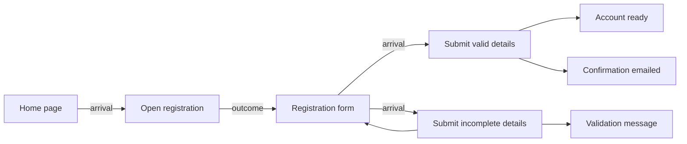

# Behavior Graph Specification

A specification for connected, traceable software requirements.

Version: 0.1 — Public draft

Date: 2026-10-01

## Contents

- [1. Purpose and scope](#1-purpose-and-scope)
- [2. Vocabulary](#2-vocabulary)
- [3. Graph model](#3-graph-model)
- [4. Action and flow semantics](#4-action-and-flow-semantics)
- [5. Authoring and validation](#5-authoring-and-validation)
- [6. Reading and changing the graph](#6-reading-and-changing-the-graph)
- [7. Rendering](#7-rendering)
- [8. Complete example](#8-complete-example)
- [9. Optional extension: versions and change impact](#9-optional-extension-versions-and-change-impact)
- [10. Optional extension: stories and rehearsal](#10-optional-extension-stories-and-rehearsal)
- [11. Optional extension: implementation and feedback](#11-optional-extension-implementation-and-feedback)
- [12. Storage and interchange](#12-storage-and-interchange)
- [13. Adoption and acceptance checks](#13-adoption-and-acceptance-checks)
- [License](#license)

## 1. Purpose and scope

Describe a product as a graph that people can read, tools can validate, and implementers can trace into code. Store each observable state once. Describe each action as a small Given–When–Then card referencing those states. Derive the flow between cards from the states they share.

The same graph supports requirements conversations, change review, journey exploration, implementation planning, and feedback about a particular version of a requirement. It remains useful without agents or automated implementation.

This document defines an open, implementation-independent model and its authoring rules. **MUST** identifies a requirement of the model; **SHOULD** identifies a recommended practice; **MAY** identifies an optional capability. Sections labeled optional extensions apply only to implementations that support those extensions.

The core comprises states, cards, personas, journeys, validation, rendering, and derived flow. Storage technology, programming language, user interface, model providers, and orchestration are implementation choices. Story generation, code traceability, and feedback are optional extensions described below.

### Relationship to Gherkin

The model borrows Gherkin's context, action/event, and observable-outcome structure. Standard Gherkin organizes these steps in scenarios and connects them to executable step definitions. See the [Cucumber Gherkin reference](https://cucumber.io/docs/gherkin/reference/).

The graph is the authoritative representation here. The text view adds card IDs, `By`, `In`, and `Status` lines; it is a Gherkin-inspired rendering, not a directly executable `.feature` file. A Cucumber exporter would need to generate standard scenarios, map metadata to tags or comments, and supply step definitions. Such an exporter is outside this specification.

## 2. Vocabulary

| Term | Meaning |
| --- | --- |
| **State** | One observable fact or condition, identified independently of its wording. |
| **Card** | One specified action or event in a particular case, with its prerequisites and expected outcome. |
| **Arrival** | The card's primary prerequisite: where the actor starts. Rendered as its first `Given`. |
| **Context** | Additional prerequisites needed by the card. Rendered as `And` after `Given`. |
| **Outcome** | The facts expected after the card's action. Rendered as `Then` and subsequent `And` lines. |
| **Persona** | An actor role, including how that actor reaches and perceives the product. |
| **Journey** | A named set of cards belonging to a recognizable activity. Membership does not specify their order. |
| **Story** | An ordered sequence of cards selected for examination or testing. Derived from the graph. |
| **Draft** | Proposed changes evaluated over a snapshot without changing the accepted graph. |
| **Finding** | A reported problem, with evidence and references to the requirements it concerns. |
| **Agenda** | Questions raised by incomplete or suspicious parts of the graph. |
| **Node revision** | A fingerprint of one stored node, used to detect stale edits. |
| **Card-content version** | A fingerprint of a card and the referenced wording it depends on, used to detect stale feedback. |

A card is a requirement, not a task ticket. A journey is a grouping, not a second copy of the requirements. A story is a selected walk, not a new source of truth.

## 3. Graph model

### 3.1 Node envelope

The portable representation is a directed property graph. Every node MUST have:

```ts
type Node = {
  id: string
  type: string
  props: Record<string, JsonValue>
  edges: Array<{
    type: string
    to: string
    props?: Record<string, JsonValue>
  }>
}
```

`JsonValue` means a JSON primitive, array, or object. IDs MUST be unique within a graph and match `^[A-Za-z0-9._-]+$`. Editing wording MUST preserve the node's ID. Types are namespaced; this specification uses `gherkin/<kind>`.

Edges are owned by their source node. A target MUST exist and have the type required by the edge. The same source MUST NOT contain two edges with the same `(type, to)` pair. One state MAY appear in several different roles on the same card, including both arrival and outcome.

The core defines no outgoing edges for states, personas, or journeys. An extension MAY add namespaced relationships with declared source and target types. Extensions MUST preserve the meaning of the core relationships.

### 3.2 Node kinds

| Type | Properties | Meaning |
| --- | --- | --- |
| `gherkin/state` | `text: string`; optional `entry: boolean`, `terminal: boolean` | A reusable prerequisite or outcome sentence. |
| `gherkin/card` | `title: string`, `when: string`; optional `planned: boolean` | One action/event and its case. |
| `gherkin/persona` | `name: string`, `kind: "human" \| "cli" \| "agent"`, `text: string` | An actor's name, interaction category, and role description. |
| `gherkin/journey` | `name: string` | A named collection of cards. |

Required strings MUST be nonempty. Authors SHOULD remove surrounding whitespace and use meaningful sentences. State text, persona names, and journey names are unique within their respective kinds after the normalization in §5.2. Card titles need not be unique; IDs distinguish them.

The persona kind `human` identifies a person using the product, `cli` an automated actor interacting through its command line, and `agent` an agent within the product. These categories describe interaction roles; they do not grant permissions.

Examples use `S-0001`, `UX-0001`, `P-0001`, and `J-0001` style IDs. These prefixes are illustrative; consumers MUST read `type` rather than infer it from an ID. Implementations MAY choose any allocation scheme that satisfies the ID rules.

### 3.3 Card relationships

| Edge | Source → target | Count per card | Meaning |
| --- | --- | --- | --- |
| `gherkin/arrives` | card → state | Exactly 1 | Primary `Given`. |
| `gherkin/given` | card → state | 0–3 | Additional context prerequisites. |
| `gherkin/then` | card → state | 1–5 | Facts making up this case's outcome. |
| `gherkin/by` | card → persona | 1 or more for newly authored cards | Who acts. |
| `gherkin/in` | card → journey | 0 or more | Which activities include this card. |

An importer MAY retain incomplete cards without personas, but MUST expose the missing attribution as an agenda item. Authoring MUST require a persona when creating a card and MUST refuse to unlink its last persona.

Multiple personas identify the roles associated with the same action. They do not encode an ordered handoff or a synchronization protocol. Use separate cards for separate actions by different actors.

### 3.4 States are facts, not complete world snapshots

`the payment form is shown` and `a receipt is emailed` are both states. Several states may hold after one action. The graph does not declare all states mutually exclusive, nor does it model the entire application state.

An `entry` state can be supplied as a starting condition without an earlier card establishing it. A `terminal` state is an acceptable endpoint that does not require a following action. These flags suppress completeness questions; they do not prohibit incoming or outgoing flow. A terminal side effect can accompany another outcome state from which the interaction continues.

## 4. Action and flow semantics

For a card `C`, let `arrival(C)` be its single arrival state, `context(C)` its extra prerequisites, and `outcomes(C)` its outcome states.

Its requirement reads:

> Given the arrival and every context condition, when the specified action occurs in this case, every outcome condition is expected to hold.

The outcome list is conjunctive. Two `then` edges mean two expected facts, not two alternative results.

Card-to-card adjacency MUST be derived as:

```text
A → B  exactly when  arrival(B) is in outcomes(A)
```

Do not store a separate authoritative `next-card` relationship. Changing a shared state reference must be sufficient to change the flow.

This relation establishes a possible continuation. Extra context conditions are not evaluated by the graph walk. A tester or execution adapter must establish them before treating a path as executable. The graph also has no built-in predicates, variable binding, timing model, or state invalidation rules.

### 4.1 Choices, cases, and loops

- **Choice:** several cards share an arrival state and describe different actions.
- **Success and failure:** separate cards describe distinguishable cases, with case-specific actions/events and their respective outcomes.
- **Several consequences:** one card has several outcome states that all belong to the same case.
- **Retry:** a card may lead back to its own arrival state, usually alongside an error-message state.
- **Shared continuation:** several cards may lead to the same state, which later cards reuse as their arrival.

Authors MUST NOT combine success and failure in one outcome list. Describe the case concretely, for example `the visitor submits incomplete registration details`; avoid `if` clauses. The graph cannot prove that cases are mutually exclusive or exhaustive. Review must assess that separately.

### 4.2 Stored graph versus flow view

Physically, all five core edge types point outward from cards. A flow diagram reverses the arrival relation for readability:



This is a view of the requirements. It does not add reverse edges to storage.

## 5. Authoring and validation

### 5.1 Atomic language

State sentences and `when` clauses MUST:

- Have at most 15 whitespace-delimited words.
- Avoid the standalone word `if`, case-insensitively.
- Express one fact or one action/event.

A standalone `and` inside a clause SHOULD produce a warning, not a rejection: it may join two facts, but it can also belong to an ordinary name. Separate facts into separate referenced states. The rendered `And` keyword between clauses is allowed.

Persona names MUST have at most four words; role descriptions MUST have at most 60 words. A role description SHOULD explain who the actor is, how they interact, and what they can see. Titles SHOULD start with a recognizable actor name and describe the action. Mechanical checks can enforce word counts and prohibited words; semantic atomicity requires review of the meaning.

Write externally meaningful behavior. Internal packages, classes, and algorithms belong in implementation plans unless they are themselves part of the actor's observable contract.

### 5.2 State reuse

Normalize text for exact matching by performing these operations in order:

1. Lowercase.
2. Trim surrounding whitespace.
3. Collapse consecutive whitespace to one space.
4. Remove one trailing period, if present.

State references in authoring operations accept either `{ "id": "S-0001" }` or `{ "text": "the registration form is shown" }`. An ID reference MUST resolve to an existing state. A text reference MUST reuse an exact normalized match or create a state when none exists. Newly created states MUST also be available for reuse within that same operation.

An explicit request to add a separate state with duplicate normalized text MUST be rejected with the existing ID. Rewording a state MUST preserve uniqueness. Persona and journey references resolve existing nodes by ID or normalized name; referencing an unknown name does not create one implicitly.

Near matches SHOULD be shown for review. One possible heuristic is the Jaccard similarity of normalized word sets: the number of shared words divided by the number of distinct words across both sentences. A score of `0.8` or greater can trigger a warning. The choice of heuristic is implementation-specific; wording similarity MUST NOT cause an automatic merge.

Reuse a state only when its meaning is the same. When superficially similar conditions describe different actors or situations, make that distinction explicit in their text.

### 5.3 Three kinds of validation result

| Result | Examples | Effect |
| --- | --- | --- |
| **Error** | Missing target; wrong edge type; duplicate edge; invalid cardinality; duplicate normalized state; clause too long | Reject the proposed write. |
| **Warning** | Near-duplicate wording; `and` within a clause | Accept an otherwise valid write and return the warning. |
| **Agenda item** | No continuation; no way to reach a state; missing persona attribution | Keep the incomplete graph usable and ask a focused question. |

A structurally valid graph may still describe an incomplete product. Implementations MUST keep those two conditions distinct.

### 5.4 Completeness agenda

An agenda SHOULD identify:

- An empty requirements graph: establish a starting condition and first action.
- A nonterminal state with no card using it as an arrival: explain the next action or mark the endpoint intentional.
- A nonentry state with no card producing it: explain how it is reached or mark it as a supplied starting condition.
- Similar states that may need to be merged.
- No personas, cards with no actors, and unused personas.

These checks examine local relationships. A closed cycle can satisfy them while remaining unreachable from an entry. Context-only states can also need an explicit explanation of how they are supplied.

When those questions are resolved, a tool MAY suggest reviewing states with only one outgoing action for missing cases. One outgoing action is not evidence that a failure case is required. Multiple cards sharing an arrival establish alternatives, but do not prove that a failure case is covered.

## 6. Reading and changing the graph

### 6.1 Read capabilities

An implementation SHOULD expose these operations independently of its UI:

| Capability | Result |
| --- | --- |
| Get node | Envelope and current node revision. |
| List by type | States, cards, personas, or journeys. |
| Query relationships | Outgoing edges and derived inbound edges. |
| Render cards | Current state wording, actions, personas, and journey membership. |
| List journey members | Card IDs; membership alone imposes no order. |
| Diff snapshots | Added, removed, and changed nodes keyed by ID. |
| Determine affected cards | Cards requiring reconsideration after a change, plus removed cards. |
| Read agenda | Specific questions tied to node IDs. |

A bounded neighborhood query is useful for focused work. Following a card to its persona and then backward to every card by that persona can select the whole product. Implementations SHOULD distinguish flow relationships from grouping and attribution relationships when defining neighborhood traversal. For example, a traversal can follow `by` and `in` backward only when their target is the original query focus.

### 6.2 Mutation contract

All accepted edits MUST pass through a validating write boundary. The minimum operations are adding and editing each node kind, linking and unlinking card relationships, and removing nodes.

A mutation produces proposed `Put(node)` and `Remove(id)` changes against a snapshot. Before persistence, validate the node envelopes, property schemas, edge types, endpoint types, cardinalities, uniqueness, and content rules. Validation failure MUST leave the accepted graph unchanged.

Linking an arrival replaces the previous arrival in one operation. Other links append a relationship after duplicate checks. Removal MUST refuse a referenced node and identify its dependents; the author must first relink or remove those dependents. Removing a card does not automatically delete its states, personas, or journeys.

Errors SHOULD carry a stable code, the affected IDs, and a concrete repair instruction. A write response SHOULD identify added, changed, and removed IDs and any warnings.

### 6.3 Stale edits

Writers SHOULD support expected node revisions, including an `absent` expectation for creation. Before applying a proposed edit, compare its expectations with current nodes and reject mismatches. Callers should include every previously read node whose content matters to the edit, not just the node they intend to write.

On a stale result, reread and reconcile the proposed change with the current requirement. Do not silently overwrite it. Revision checks need a serialized writer or transactional storage to provide strong concurrent-write guarantees; hash comparison alone is insufficient.

### 6.4 Drafts and previews

A draft is an ordered list of ordinary authoring operations. Each operation sees the working snapshot left by earlier successful operations. A draft MUST NOT modify the accepted graph.

Expose a dry run that reports validity, problems, touched nodes, and affected cards. Expose a comparison showing cards before and after, including cards indirectly affected by a shared-state edit. New or removed cards have an absent side of the comparison.

Every independently committed operation must preserve structural validity. Replacing a sole outcome therefore requires linking the replacement before unlinking the old outcome. An invalid intermediate operation cannot rely on a later operation to repair it.

A dry run SHOULD use the same validation rules as an accepted write and MUST identify any checks it could not perform. It MUST NOT report a draft as valid when an operation fails. An implementation MAY continue after a failed operation to collect more diagnostics, but MUST distinguish that partial preview from a valid proposal.

Accepted writes MUST still undergo full validation against the current graph. A successful preview does not reserve node IDs or prevent concurrent edits; implementations SHOULD recheck the snapshot's revisions before applying a draft.

## 7. Rendering

A card MUST render its current referenced state text, rather than a copy saved inside the card. Render in this order:

1. Card ID and title.
2. Planned status, when present.
3. Personas and journeys, when present.
4. Arrival as `Given`, then context states as `And`.
5. Exactly one `When`.
6. First outcome as `Then`, then remaining outcomes as `And`.

Preserve edge order within each role so the presentation is stable. IDs SHOULD accompany displayed state text to make reuse and editing unambiguous. Missing references in a damaged or imported graph SHOULD be visibly marked rather than invented or silently omitted.

A journey view derives order from flow, marks branches and loopbacks, and includes disconnected members. It MUST NOT manufacture a linear sequence just because cards belong to the same journey.

## 8. Complete example

This example describes registration, including a failure that leaves the form available for retry. All cards are explicitly planned. The wrapper `{ "nodes": [...] }` groups node envelopes for illustration; it does not prescribe a storage layout.

```json
{
  "nodes": [
    {
      "id": "P-0001", "type": "gherkin/persona",
      "props": { "name": "Visitor", "kind": "human", "text": "A person creating an account through the website. They see forms, messages, and confirmation emails." },
      "edges": []
    },
    {
      "id": "J-0001", "type": "gherkin/journey",
      "props": { "name": "Create an account" }, "edges": []
    },
    {
      "id": "S-0001", "type": "gherkin/state",
      "props": { "text": "the home page is shown", "entry": true }, "edges": []
    },
    {
      "id": "S-0002", "type": "gherkin/state",
      "props": { "text": "the registration form is shown" }, "edges": []
    },
    {
      "id": "S-0003", "type": "gherkin/state",
      "props": { "text": "the account is ready", "terminal": true }, "edges": []
    },
    {
      "id": "S-0004", "type": "gherkin/state",
      "props": { "text": "a confirmation email is sent", "terminal": true }, "edges": []
    },
    {
      "id": "S-0005", "type": "gherkin/state",
      "props": { "text": "a validation message identifies missing details", "terminal": true }, "edges": []
    },
    {
      "id": "UX-0001", "type": "gherkin/card",
      "props": { "title": "Visitor opens registration", "when": "the visitor opens registration", "planned": true },
      "edges": [
        { "type": "gherkin/by", "to": "P-0001" },
        { "type": "gherkin/in", "to": "J-0001" },
        { "type": "gherkin/arrives", "to": "S-0001" },
        { "type": "gherkin/then", "to": "S-0002" }
      ]
    },
    {
      "id": "UX-0002", "type": "gherkin/card",
      "props": { "title": "Visitor creates an account", "when": "the visitor submits valid registration details", "planned": true },
      "edges": [
        { "type": "gherkin/by", "to": "P-0001" },
        { "type": "gherkin/in", "to": "J-0001" },
        { "type": "gherkin/arrives", "to": "S-0002" },
        { "type": "gherkin/then", "to": "S-0003" },
        { "type": "gherkin/then", "to": "S-0004" }
      ]
    },
    {
      "id": "UX-0003", "type": "gherkin/card",
      "props": { "title": "Visitor submits incomplete details", "when": "the visitor submits incomplete registration details", "planned": true },
      "edges": [
        { "type": "gherkin/by", "to": "P-0001" },
        { "type": "gherkin/in", "to": "J-0001" },
        { "type": "gherkin/arrives", "to": "S-0002" },
        { "type": "gherkin/then", "to": "S-0002" },
        { "type": "gherkin/then", "to": "S-0005" }
      ]
    }
  ]
}
```

The last card renders as:

```gherkin
UX-0003 Visitor submits incomplete details
  Status planned
  By    Visitor  # P-0001
  In    Create an account  # J-0001
  Given the registration form is shown  # S-0002
  When  the visitor submits incomplete registration details
  Then  the registration form is shown  # S-0002
  And   a validation message identifies missing details  # S-0005
```

`UX-0001` can continue to either submission card. `UX-0003` can continue to itself or to `UX-0002`. Both submission cards reuse the same form state. Rewording `S-0002` updates all three cards' rendered requirements without editing any of the card nodes.

## 9. Optional extension: versions and change impact

### 9.1 Two different fingerprints

A node revision answers, “Has this stored node changed since I read it?” A card-content version answers, “Has the requirement this feedback concerns changed?” Implementations supporting feedback SHOULD expose both rather than treat them as interchangeable.

The card-content version defined by this extension covers:

- Card properties except `planned`.
- Every non-journey edge, in stored order, including its role and target ID.
- Referenced state text and persona names.

It excludes journey membership, state entry/terminal flags, and persona role descriptions. Changing an actor description may therefore warrant a new rehearsal even when existing card-content versions remain equal. Reordering relevant edges changes the fingerprint; it is not a semantic-equivalence proof.

Entity references can be written as `gherkin/card:UX-0002@<version>`. The suffix records the version observed; it is not a promise that the provider stores or retrieves historical content. A consumer must compare it with the current version before reusing evidence or applying a version-dependent decision.

### 9.2 Change-impact analysis

Change-impact analysis identifies requirements to reconsider after an edit. It SHOULD include added cards, cards whose action or relationships changed, and surviving cards that reference a reworded state. Removed cards SHOULD be reported separately so their implementation can be reviewed for removal or reassignment.

A change to `planned` alone changes the implementation claim, not the required behavior. Changes to persona descriptions, journey membership, or state entry/terminal flags can affect review, navigation, or story selection without requiring code changes. Implementations SHOULD document which changes trigger each kind of work.

The two fingerprints distinguish changes as follows:

| Change | Card node revision changes? | Card-content version changes? |
| --- | --- | --- |
| Its title or `when` changes | Yes | Yes |
| A referenced state's text changes | No | Yes |
| A referenced state's entry/terminal flag changes | No | No |
| A referenced persona's name changes | No | Yes |
| A referenced persona's description changes | No | No |
| Its `by` relationship changes | Yes | Yes |
| Its journey membership changes | Yes | No |
| Only its `planned` flag changes | Yes | No |

Selecting a card for reconsideration does not guarantee a source-code change is necessary. Implementations MAY expand review to downstream cards, but SHOULD distinguish direct impact from that broader review scope.

## 10. Optional extension: stories and rehearsal

A story planner selects finite walks through the derived card adjacency. It SHOULD disclose what it did not cover. This extension defines three strategies:

| Strategy | Behavior |
| --- | --- |
| `teleport` | Each card is a one-card story. Useful for isolated review. |
| `edge-pair` | Graph-wide walks covering reachable cards, adjacent card pairs, and consecutive triples after loopbacks are removed. |
| `journey` | The same coverage within each journey, plus two-card handoffs between journeys and one-card stories for ungrouped cards. |

For `edge-pair`, roots are cards whose arrival is an entry state or has no predecessor in the selected set. One implementation removes back edges discovered by depth-first search and greedily chooses root-to-leaf walks covering the remaining requirements. Alternative algorithms MAY be used if they provide the stated coverage and disclose excluded transitions. A consecutive triple covers two adjacent transitions; it does not mean every possible path is tested.

A journey handoff is an adjacency from a member of one journey to a card outside that journey that belongs to another. Duplicate handoff pairs are emitted once. Cards in multiple journeys participate in each journey's coverage. Focus filters whole stories that contain a focused card; it does not trim those stories to the focused cards alone.

Cycles without a root can remain unwalked. Planners SHOULD identify unreachable cards and excluded loopbacks, and MUST state whether coverage counts refer to distinct cards, transitions, or journey memberships. Loopbacks excluded from story selection remain part of the requirements and journey views. A retry test must explicitly exercise the retry; finite story selection alone does not prove it works.

Rehearsal MAY ask people or agents to examine stories as particular personas. Feedback should name the card version examined and distinguish unclear wording, missing behavior, contradictions, impossible transitions, and divergence from implementation. Such review supplements runnable tests. It does not establish that the product executes correctly.

## 11. Optional extension: implementation and feedback

### 11.1 Traceability and planned behavior

Code and tests MAY carry the requirement ID in the language's comment syntax:

```ts
// @card UX-0002
```

A traceability audit SHOULD detect three inconsistencies:

- An unplanned card has no matching code tag.
- A planned card already has a matching tag.
- A tag refers to a card that does not exist.

Teams using this convention SHOULD tag both implementation and its tests. Tag presence establishes traceability; it does not establish test coverage or behavioral correctness. Auditors SHOULD exclude documentation examples from code scans.

`planned: true` means the specified behavior is not built yet. An absent or false flag does not independently prove implementation; the audit checks that claim against tags or equivalent implementation evidence.

A rehearsal of implemented behavior SHOULD stop before a card that is planned or lacks implementation evidence, and report why it stopped. A specification review MAY include such cards. When evidence is unavailable, a reviewer MUST disclose that limitation rather than present the result as verification of implemented behavior.

### 11.2 Feedback and reconciliation loop

A minimal workflow is:

```text
Describe intent → author cards → review the graph → implement and test
                       ↑                              ↓
                 accept a draft ← triage ← versioned feedback
```

Keep accepted requirements, proposed drafts, and implementation plans separate. Feedback SHOULD refer to the card-content version examined. A draft SHOULD show its direct and shared-state effects before acceptance. Applying it must revalidate the current graph.

A mismatch between code and a card needs a decision: change the requirement or change the implementation. Neither source should silently redefine the other. Once accepted requirements change, reconcile the affected cards against code and tests.

Rehearsal, feedback triage, backlog planning, and code reconciliation can consume the graph through its read and mutation capabilities. Their queues, interfaces, and runtime architecture are outside this specification.

## 12. Storage and interchange

Implementations MAY use files, a database, or another durable store. A simple file layout places one JSON envelope at `nodes/<id>.json`. Inbound relationships are derived from source-owned edges. Snapshot diffs match nodes by ID and edges by `(type, to)`.

Exports MUST preserve IDs, node properties, relationships, and edge order. Imports MUST validate the complete graph, including duplicate IDs before building an ID-indexed map. An importer MAY retain unsupported extension types as opaque data or reject them clearly; it MUST NOT silently discard them or reinterpret them as core types.

Deterministic serialization is useful for review and content fingerprints. An implementation SHOULD document its key ordering, array ordering, whitespace, encoding, and fingerprint algorithm. One readable convention recursively sorts object keys, preserves array order, uses two-space indentation, and ends with a newline. Cross-implementation comparison of fingerprint strings requires agreement on both serialization and hashing. This specification defines their input data and meaning, not a mandatory hash algorithm.

Implementations MUST document the atomicity and recovery guarantees of their write boundary. Replacing a single file atomically does not make a multi-node edit transactional. Systems with concurrent writers SHOULD use an appropriate serialization or transaction mechanism around revision checks and persistence.

Damaged data MUST be reported rather than silently replaced. A recovery interface MAY expose the valid remainder of a graph, with missing references visibly marked. IDs associated with unresolved damaged records MUST remain reserved until recovery so ordinary authoring cannot overwrite them. Storage-level edits and imports MUST be validated before they become accepted requirements.

## 13. Adoption and acceptance checks

A team can adopt the workflow with four steps:

1. Name the actors and describe what each can observe.
2. Write one journey as small cards, reusing states wherever meaning is shared.
3. Resolve structural errors, then review the agenda and the actual user flow.
4. Link implemented behavior and tests to cards; keep unbuilt behavior explicitly planned.

An implementation claiming conformance to the core MUST satisfy its mandatory rules and SHOULD demonstrate the cases below. Optional capabilities and extensions SHOULD be identified explicitly; a storage format or UI alone does not establish conformance.

| Check | Expected result |
| --- | --- |
| Reference `The form is shown.` and `the form is shown` by text | Reuse one state. |
| Reword a state used by three cards | Preserve its ID; all three render the new sentence. |
| Add two outcomes to one card | Render both as required consequences of that case. |
| Add two cards with the same arrival | Derive a branch without a stored card-to-card edge. |
| Use a state as both arrival and outcome | Accept a loop; rendering and graph queries terminate. |
| Add zero/six outcomes or four context states | Reject without persisting the proposal. |
| Add a duplicate edge, wrong-type endpoint, or missing target | Reject with a specific diagnostic. |
| Add a 16-word clause or a standalone `if` | Reject; a standalone `and` only warns. |
| Add a card without actors; unlink its last actor | Reject ordinary authoring. |
| Retain an imported card without actors | Keep it inspectable and raise an agenda item. |
| Put one card in two journeys | Show it in both without copying it or inventing order. |
| Remove a referenced state, persona, or journey | Refuse and name the dependents. |
| Submit an outdated expected revision | Refuse; retain the current requirement. |
| Preview an invalid draft | Report failure; keep accepted requirements unchanged. |
| Finish every local agenda question | Do not claim executable-path coverage or product completeness. |

For optional extensions, also check the change matrix in §9, unrooted cycles and journey handoffs in §10, and all three traceability inconsistencies in §11.

## License

This specification and its examples are available under the [MIT License](LICENSE).
